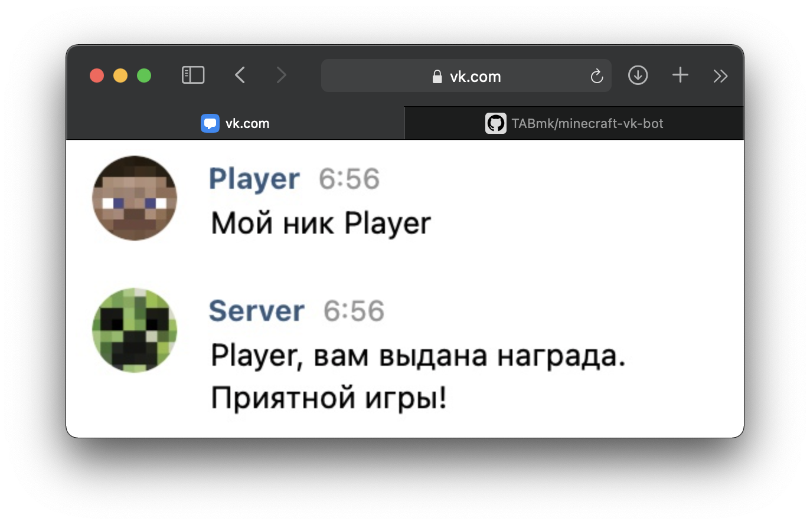

[ENG] Since the project aimed at work with CIS countries social network, description is on Russian

---
<p align="center">
  
  <h1 style="text-align: center">minecraft-vk-bot</h1>
</p>

###### Бот для получения наград за подписку на группу ВКонтакте

###### Особенности:
- Проверка на подписку
- Разные виды наград (сообщение, выполнение команды на сервере, записывание данных в базу)
- Работа с Rcon и MySQL
- Гибкий конфиг. _Даже SQL запросы можно настроить сразу в нем._
- Проверка существования пользователя по нику
- Один пользователь ВК может выдать подарок только на один ник
- Один игрок на сервере может получить подарок только один раз
- Автоподключение к Rcon
- Полная настройка команды через конфиг
- Код с комментариями
- Полное описание конфига

_Помощь и вопросы в [Issues](https://github.com/TABmk/minecraft-vk-bot/issues) или ко мне в тг [@TAB_mk](http://t.me/tab_mk)_

---
## Требования
- [Node.JS](https://nodejs.org/en/) (Рекомендуемая версия 12 и выше)
- NPM или [Yarn](https://yarnpkg.com/getting-started/install) для установки зависимостей
- [AuthMeReloaded](https://www.spigotmc.org/resources/6269/) на сервере, если вы хотите ничего не менять в коде (нужен для проверки пользователей и записи ID)
- База AuthMeReloaded в MySQL
- Включенный Rcon на сервере, если нужно выдавать награду командой
- Токен группы ВК с доступом к сообщениям (Управление > Работа с API > Создать ключ)
- Если вы используете AuthMeReloaded, как и задумано, то нужно создать столбец для vkID в таблице authme:
  - `USE authme;`
  - `ALTER TABLE authme ADD vkid INT NULL;`
---
## Скачивание
[[Скачать](https://github.com/TABmk/minecraft-vk-bot/archive/refs/heads/master.zip)] архив с проектом

или

```
git clone https://github.com/TABmk/minecraft-vk-bot.git
```
## Установка
```
npm i
   или
yarn install
```
## Запуск
```
npm run start
   или
yarn start
```
---
## Принцип работы
 - Пользователь пишет команду, в которой указывает свой ник.
 - Запрашивается ник в таблице authme.
 - Проверяет, не ли пользователь уже подарок. Проверяя поле vkid на наличие ID этого человека. Если он уже выдал кому-то подарок, то пишет ошибку `config -> messages.vkuser_already_rewarded`
 - Если нет выдавал, то теперь проверяет по нику. Получал ли игрок уже подарок. Если да, то ошибка `config -> messages.player_already_rewarded`
 - Если не получал, то проверяется, есть ли вообще такой игрок в базе. Нет -- ошибка `config -> messages.player_check_fail`
 - Если есть, то выводит сообщение о подарке `config -> messages.success`
 - И запускает выдачу подарка. Тип выдачи указывается в `config -> reward_type`
---
## FAQ

#### ❓ Как запретить спам командой

Из коробки спам не отлавливается. Для реализации функции можно использовать:
- [RabbitMQ](https://www.rabbitmq.com)
- [Мою реализацию](https://github.com/TABmk/queue-antispam-for-bots) in-memory очередей для ботов
- Просто сохранять в кэше массивом/Set\`ом и проверять кол-во сообщений

#### ❓ Используется не AuthMeReloaded, что делать

Посмотрите как у вашего плагина записывается в базу данные и подправьте SQL запросы в конфиге под них. И не забудьте создать столбец для сохранений vkid

#### ❓ Как запустить на постояне

- Собрать в докер-контейнер
- [PM2](https://pm2.keymetrics.io) (самое простое решение)
- screen (для линуксов)

#### ❓ Есть идея для новой фичи

Открывай [issue](https://github.com/TABmk/minecraft-vk-bot/issues)

---
## Переменные

В некоторых сообщениях и конфигах можно использовать переменные, которые автоматически заменятся на значения в коде.

|Переменная|Описание|
|---|---|
|%nickname%|Вставляет ник, который пользователь написал|
|%nickname_lower%|Ник, но в нижнем регистре|
|%vkid%|ID пользователя ВК|

---
## Конфиг
#### modules
- ###### mysql
  Параметры подключения к mysql базе с помощью клиента [mysql-await](mysql-await)
   - **host** - ip mysql сервера
   - **user** - пользователь
   - **password** - пароль
   - **database** - база (для AuthMeReloaded - authme)
- ###### rcon
  Данные от Rcon вашего сервера для rcon клиента [rcon-client](https://www.npmjs.com/package/rcon-client)
  - **host** - ip сервера
  - **port** - порт сервера
  - **password** - пароль от rcon
- ###### vk
  Данные для модуля [easyvk](https://www.npmjs.com/package/easyvk)
  - **token** - токен вашего сообщества с правами доступа к сообщениям `(Управление > Работа с API > Создать ключ)`

#### reward_type
Задает способ выдачи награды игроку.
Все типа поддерживают [переменные](#переменные)
###### Доступные значения
|Тип|Описание|Конфиг|
|---|---|---|
|`msg`|Просто отправляет сообщение. Можно использовать для выдачи промокодов, например|`messages.reward`|
|`rcon`|Позволяет выполнить команду на сервере. Для выдачи прав или валюты, например|`rcon.reward`|
|`sql`|Позволяет выполнить SQL запрос к базе|`sql.reward`|

#### command
- **RegExp** - регулярное выражение для команды. Если нужно чтобы команда была в точности такой, то нужно добавить `^` в начале и `$` в конце. `(.*)` обозначает место, где должен стоять ник.
- **RegExp_flags** - устанавливает [флаги](https://developer.mozilla.org/ru/docs/Web/JavaScript/Reference/Global_Objects/RegExp#parameters). Если не знаешь что это, просто оставь `i`

#### rcon
- **reward** - команда для награды. Поддерживает [переменные](#переменные)
- **reconnect_time** - время между попытками переподключиться к rcon, если он не отвечает. Время в мс (1000 мс = 1 секунда)

#### sql
  Все запросы поддерживают [переменные](#переменные)
- **check_user** - проверка игрока в базе
- **check_vkid** - проверка вк пользователя в базе
- **save_vkid** - сохраненик id вк в базе
- **reward** - запрос для награды

#### messages
  Все сообщения поддерживают [переменные](#переменные)
- **reward** - сообщение с наградой
- **success** - сообщение о получении награды
- **player_check_fail** - игрок не найден
- **vkuser_already_rewarded** - пользователь вк уже получал награду
- **player_already_rewarded** - игрок уже получал награду
